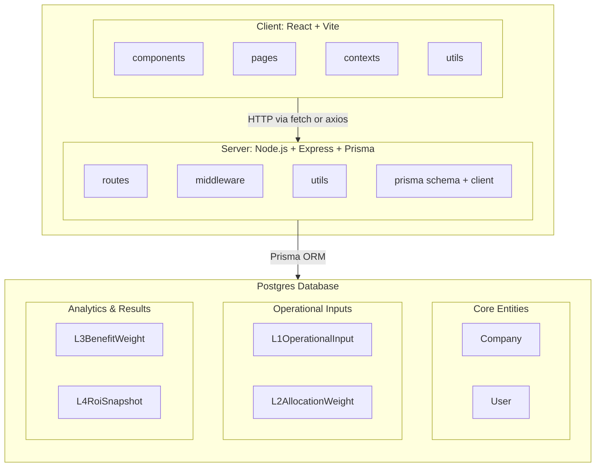

```mermaid
flowchart TB
  %% Row 1: Client & API
  subgraph Row1[ ]
    direction LR
    subgraph Client[Client: React + Vite]
      direction TB
      C1[components]
      C2[pages]
      C3[contexts]
      C4[utils]
    end

    subgraph API[Server: Node.js + Express + Prisma]
      direction TB
      R1[routes]
      M1[middleware]
      U1[utils]
      P1[prisma schema + client]
    end
  end

  Client -->|HTTP via fetch or axios| API

  %% Row 2: Database
  subgraph DB[Postgres Database]
    direction TB

    subgraph Core[Core Entities]
      D1[Company]
      D2[User]
    end

    subgraph Operational[Operational Inputs]
      D3[L1OperationalInput]
      D4[L2AllocationWeight]
    end

    subgraph Analytics[Analytics & Results]
      D5[L3BenefitWeight]
      D6[L4RoiSnapshot]
    end
  end

  API -->|Prisma ORM| DB

```